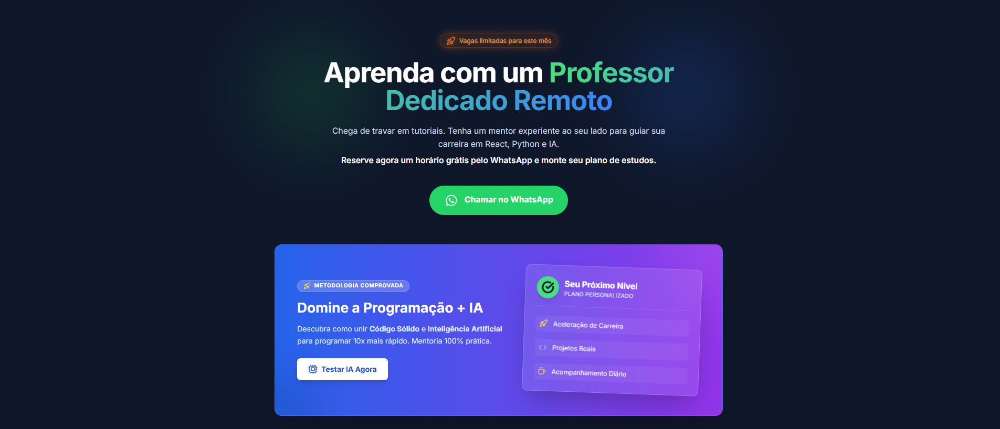

## CTA Cursos  React/Next ( fev/2026 )
> * Criando página incrível



**CTA Cursos** é uma coleção moderna e polida de componentes e páginas React + TypeScript construída com Vite — pensada para criar CTAs (calls-to-action) atrativos, responsivos e fáceis de integrar em sites e landing pages.

**Destaques:**
- **Design profissional:** componentes prontos para uso com estética moderna.
- **Alto desempenho:** empacotado com Vite para builds rápidos.
- **TypeScript:** tipagem sólida para produtividade e manutenção.
- **Fácil integração:** exemplos práticos e componentes desacoplados.

**Demo / Imagem do Projeto**


Visuais rápidos do projeto estão na pasta `./preview` — a imagem usada neste README está em `./preview/cta-react.png`.

**Instalação Rápida**

1. Clone o repositório:

```
git clone <URL_DO_REPOSITORIO>
cd cta-cursos
```

2. Instale dependências:

```
npm install
```

3. Execute em modo de desenvolvimento:

```
npm run dev
```

4. Build para produção:

```
npm run build
```

**Estrutura Principal**

- `index.tsx` / `App.tsx` — ponto de entrada e layout principal
- `components/` — componentes reutilizáveis (ex.: `TechCard.tsx`, `MarkdownViewer.tsx`)
- `preview/` — imagens e ativos de demonstração (a imagem usada aqui: `cta-react.png`)
- `services/` — integrações e serviços (ex.: `geminiService.ts`)

**Como usar um componente (exemplo rápido)**

Importe e use o componente diretamente:

```tsx
import TechCard from './components/TechCard';

function Demo() {
  return <TechCard title="React" description="Biblioteca UI" />;
}

export default Demo;
```

**Boas práticas e contribuições**

- Abra uma issue descrevendo a melhoria ou bug.
- Para propostas de features, abra uma *feature request* com mockups quando possível.
- Envie PRs pequenas e bem descritas; inclua testes se aplicável.

**Licença**

Este projeto não inclui uma licença explícita por enquanto — adicione um `LICENSE` conforme sua preferência (MIT, Apache-2.0, etc.).

**Contato**

Se quiser ajuda para adaptar estes componentes ao seu projeto, abra uma issue ou envie um e-mail para o mantenedor do repositório.

---

Obrigado por conferir o `CTA Cursos` — pronto para transformar visitantes em ações!
